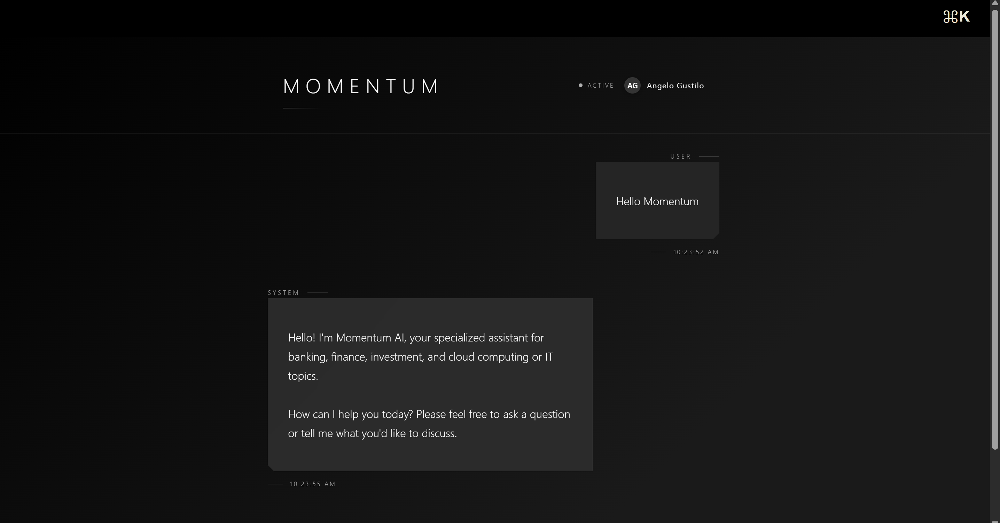
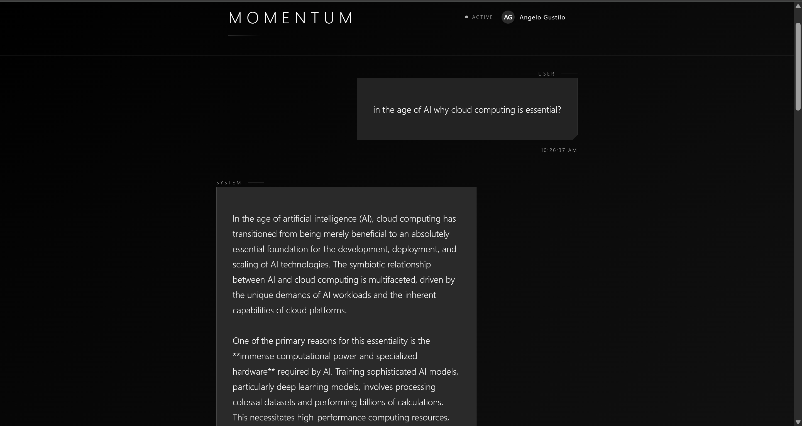

<pre align="center">
   █████╗ ███╗   ██╗ ██████╗ ███████╗██╗      ██████╗
  ██╔══██╗████╗  ██║██╔════╝ ██╔════╝██║     ██╔═══██╗
  ███████║██╔██╗ ██║██║  ███╗█████╗  ██║     ██║   ██║
  ██╔══██║██║╚██╗██║██║   ██║██╔══╝  ██║     ██║   ██║
  ██║  ██║██║ ╚████║╚██████╔╝███████╗███████╗╚██████╔╝
  ╚═╝  ╚═╝╚═╝  ╚═══╝ ╚═════╝ ╚══════╝╚══════╝ ╚═════╝
 ██████╗ ██╗   ██╗███████╗████████╗██╗██╗      ██████╗
██╔════╝ ██║   ██║██╔════╝╚══██╔══╝██║██║     ██╔═══██╗
██║  ███╗██║   ██║███████╗   ██║   ██║██║     ██║   ██║
██║   ██║██║   ██║╚════██║   ██║   ██║██║     ██║   ██║
╚██████╔╝╚██████╔╝███████║   ██║   ██║███████╗╚██████╔╝
 ╚═════╝  ╚═════╝ ╚══════╝   ╚═╝   ╚═╝╚══════╝ ╚═════╝
</pre>

**I don't just build AI systems. I ship them.**

## THE SHORT VERSION

I architect and deploy production AI systems on cloud infrastructure. Not demos. Not notebooks. **Real systems** with auth, persistence, orchestration, and users hitting them concurrently.

My sweet spot? Taking an idea from "wouldn't it be cool if..." to a containerized, Kubernetes-orchestrated reality running on GCP — often at zero infrastructure cost.

## TECH I SHIP WITH

**CLOUD & INFRA**

**BACKEND & AI**

**FRONTEND & DATA**

## WHAT I'VE BUILT

### MOMENTUM AI — Intelligent Financial Assistant

> *When a calculator meets a conversational AI, and both actually work in production.*

A hybrid AI system that knows the difference between "explain compound interest" and "calculate my debt payoff schedule" — and handles both flawlessly.

  

  

<b>SEE WHAT'S UNDER THE HOOD</b>

 

**THE PROBLEM:** Users need both precise financial calculations AND conversational AI — but most systems do one or the other, poorly.

**THE SOLUTION:** Intent detection that routes queries to either a specialized financial engine (debt payoff, amortization, loan math) or an LLM with RAG enhancement.

**KEY ENGINEERING:**
- Multi-tier LLM fallback: Gemini 2.5 Flash → GPT-3.5 → Ollama (never fails silently)
- FAISS vector search for retrieval-augmented responses
- Per-user auth, chat history, and session persistence
- Command palette with keyboard shortcuts (Cmd/Ctrl+K)
- Full CI/CD via GitHub Actions → Docker → K3s on GCP

**STACK:** FastAPI | React 18 | Material-UI | MySQL | Kubernetes | Traefik | GCP

---

### CLOUD-NATIVE RAG PLATFORM

> *Production-grade retrieval-augmented generation. Not a Jupyter notebook — an actual deployed system.*

Re-architected from prototype to fully containerized platform handling concurrent multi-user workloads.

<b>SEE WHAT'S UNDER THE HOOD</b>

 

**THE CHALLENGE:** Turn a working prototype into something that survives real users, real load, and real production conditions.

**WHAT I BUILT:**
- FastAPI backend with authenticated REST endpoints for conversational AI
- Gemini 2.5 Flash integration with structured reasoning pipelines
- System prompts constrained for domain-specific responses (cloud architecture, finance)
- React frontend deployed as K8s-managed service
- MySQL with persistent volumes — data survives pod restarts
- Traefik ingress exposing the whole thing securely to the internet

**BATTLE SCARS (PROBLEMS I SOLVED):**
- Container image pull auth failures
- K8s DNS and service resolution nightmares
- Environment variable injection mismatches
- Database connectivity edge cases under concurrent load

**RESULT:** Multi-user deployment validated live. Zero crashes. Zero data loss.

---

### SALES PREDICTION WITH TENSORFLOW

> *When you want to know what's going to sell — and by how much.*

Deep learning regression model for sales forecasting, built with TensorFlow and grounded in solid exploratory data analysis.

<b>SEE WHAT'S UNDER THE HOOD</b>

 

**THE GOAL:** Predict sales outcomes using historical data and deep learning.

**APPROACH:**
- Exploratory data analysis to understand patterns, distributions, and feature relationships
- Feature engineering informed by EDA insights
- TensorFlow regression model for sales prediction
- Model evaluation and performance analysis

**STACK:** Python | TensorFlow | Pandas | Jupyter Notebook

## CURRENTLY

- Engineering AI solutions at **Customer Echoes** — building dashboards, lead management systems, and translating AI specs into business outcomes
- Obsessing over the gap between "it works on my machine" and "it works in production"
- Exploring what happens when you throw real constraints at AI systems

## LET'S CONNECT

I'm always down to talk about cloud architecture, AI systems that actually ship, or why Kubernetes is simultaneously the best and worst thing ever.

**"The best code is code that's running somewhere, doing something, for someone."**

