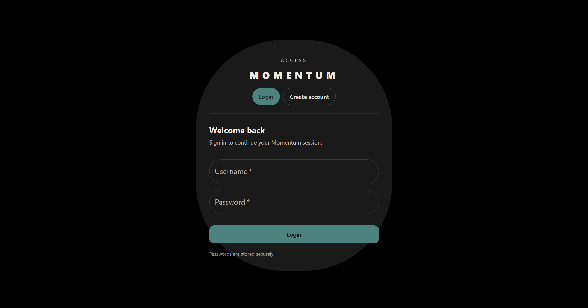
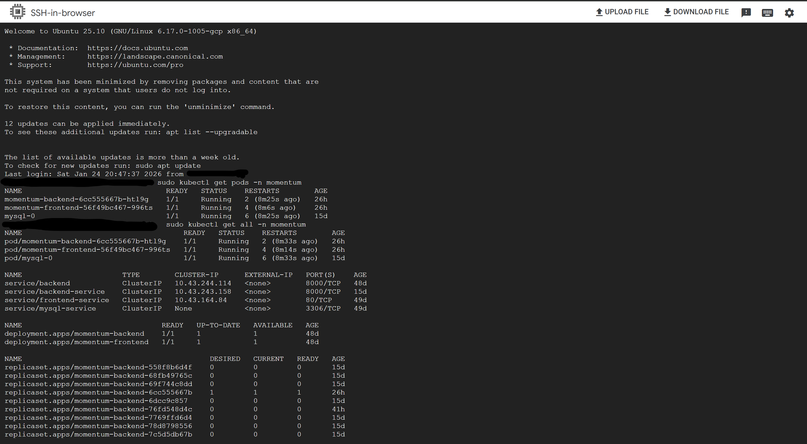
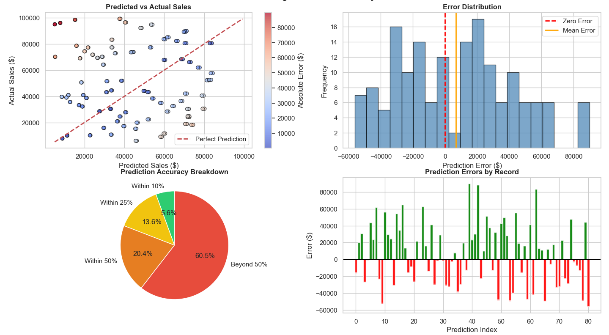
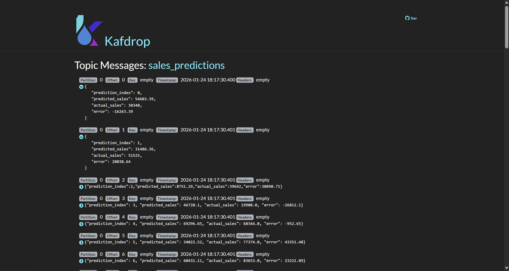

**I don't just build AI systems. I ship them.**

## THE SHORT VERSION

I architect and deploy production AI systems on cloud infrastructure. Not demos. Not notebooks. **Real systems** with auth, persistence, orchestration, and users hitting them concurrently.

My sweet spot? Taking an idea from "wouldn't it be cool if..." to a containerized, Kubernetes-orchestrated reality running on GCP - often at zero infrastructure cost.

## TECH I SHIP WITH

**CLOUD & INFRA**

**BACKEND & AI**

**FRONTEND & DATA**

## WHAT I'VE BUILT

### MOMENTUM AI - Cloud Computing & Banking Expert

> *Enterprise-grade AI that speaks cloud architecture and banking - deployed in production.*

A hybrid AI system built for cloud computing guidance and banking expertise, handling everything from GCP infrastructure questions to financial analysis with precision.

  

<b>SEE WHAT'S UNDER THE HOOD</b>

 

**THE PROBLEM:** Users need expert guidance on cloud architecture AND banking concepts - but most AI systems lack domain-specific depth.

**THE SOLUTION:** Intent detection that routes queries to specialized engines for cloud computing (GCP, Kubernetes, infrastructure) or banking expertise (financial analysis, loan calculations) with RAG enhancement.

**KEY ENGINEERING:**
- Multi-tier LLM fallback: Gemini 2.5 Flash → GPT-3.5 → Ollama (never fails silently)
- FAISS vector search for retrieval-augmented responses
- Per-user auth, chat history, and session persistence
- Command palette with keyboard shortcuts (Cmd/Ctrl+K)
- Full CI/CD via GitHub Actions → Docker → K3s on GCP

**STACK:** FastAPI | React 18 | Material-UI | MySQL | Kubernetes | Traefik | GCP

---

### CLOUD-NATIVE RAG PLATFORM

> *Production-grade retrieval-augmented generation. Not a Jupyter notebook - an actual deployed system.*

Re-architected from prototype to fully containerized platform handling concurrent multi-user workloads.

<b>SEE WHAT'S UNDER THE HOOD</b>

 

**THE CHALLENGE:** Turn a working prototype into something that survives real users, real load, and real production conditions.

**WHAT I BUILT:**
- FastAPI backend with authenticated REST endpoints for conversational AI
- Gemini 2.5 Flash integration with structured reasoning pipelines
- System prompts constrained for domain-specific responses (cloud architecture, finance)
- React frontend deployed as K8s-managed service
- MySQL with persistent volumes - data survives pod restarts
- Traefik ingress exposing the whole thing securely to the internet

**BATTLE SCARS (PROBLEMS I SOLVED):**
- Container image pull auth failures
- K8s DNS and service resolution nightmares
- Environment variable injection mismatches
- Database connectivity edge cases under concurrent load

**RESULT:** Multi-user deployment validated live. Zero crashes. Zero data loss.

---

### SALES PREDICTION WITH REAL-TIME KAFKA STREAMING

> *Predict sales. Stream predictions. Monitor in real-time.*

End-to-end ML pipeline combining TensorFlow regression with Apache Kafka for live prediction streaming and monitoring.

  

<b>SEE WHAT'S UNDER THE HOOD</b>

 

**THE GOAL:** Predict aggregated sales performance and stream predictions in real-time for live monitoring.

**DATA PROCESSING:**
- EDA on 500 customer transaction records revealing seasonality patterns, marketing ROI, and churn demographics
- Missing value imputation and outlier removal using IQR method
- Feature engineering informed by correlation analysis

**ML PIPELINE:**
- Linear regression baseline for interpretability
- TensorFlow neural network (2 hidden layers) capturing non-linear relationships between marketing spend, seasonality, and sales

**REAL-TIME STREAMING:**
- Kafka message broker streams 81 prediction records to `sales_predictions` topic
- Kafdrop web UI visualizes predictions with error analysis
- Schema includes prediction index, predicted/actual sales, and error metrics

**STACK:** TensorFlow | Pandas | Apache Kafka | Kafdrop | Docker | Docker Compose

## CURRENTLY

- **Open to work** - yes, this is my way of saying *please hire me*
- Mass applying to jobs like my Kafka producer pushes messages - high throughput, hoping for at least one successful delivery
- Still obsessing over the gap between "it works on my machine" and "it works in production"
- Available immediately. Will deploy AI systems for coffee. Or money. Preferably both.

## LET'S CONNECT

I'm always down to talk about cloud architecture, AI systems that actually ship, why Kubernetes is simultaneously the best and worst thing ever - or **job opportunities** (seriously, my inbox is ready).

**"The best code is code that's running somewhere, doing something, for someone."**

